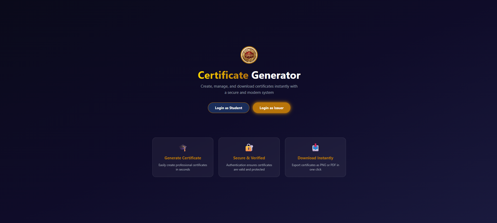
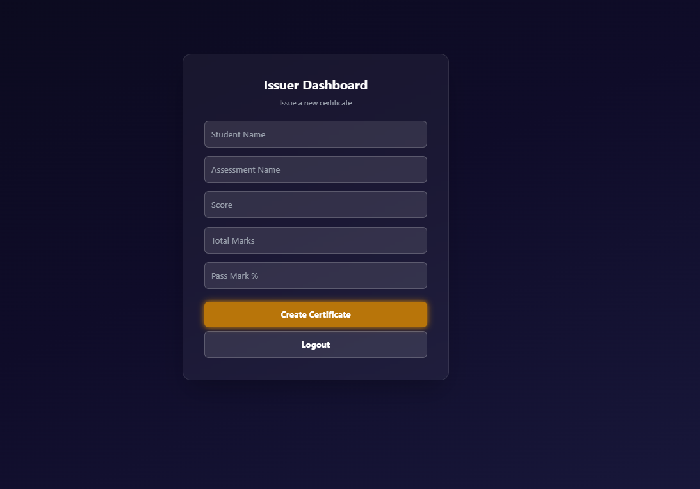
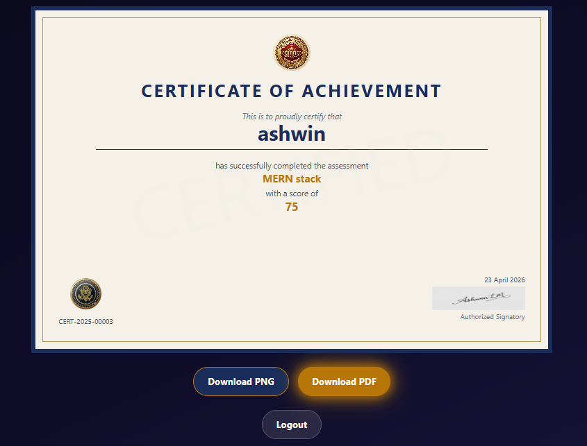
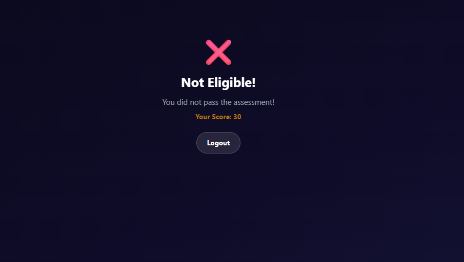

# 🎓 Certificate Generation System

A full-stack web application built using the **MERN Stack** (MongoDB, Express.js, React.js, Node.js) that allows organizations to automatically generate and distribute digital certificates to students based on their assessment scores.

---

## 🌟 Live Demo

> Run locally using the steps below.

---

## 📸 Screenshots

| Home Page | Issuer Dashboard |
|-----------|-----------------|
|  |  |

| Certificate | Not Eligible |
|-------------|-------------|
|  |  |

---

## ✨ Features

- 🔐 **JWT Authentication** — Secure login and register with JSON Web Tokens
- 🔒 **Password Hashing** — Passwords encrypted using bcryptjs before storing
- 👥 **Role Based Access** — Two roles: Issuer (Admin) and Student
- ✅ **Eligibility Check** — Auto calculates if student passed based on score
- 🎫 **Unique Certificate Number** — Auto generates CERT-2025-00001 format
- 📄 **Download as PNG** — Export certificate as high resolution image
- 📑 **Download as PDF** — Export certificate as PDF document
- 🛡️ **Protected Routes** — Unauthorized users cannot access dashboards
- 🎨 **Glassmorphism UI** — Modern dark themed design with animations
- 📱 **Responsive Design** — Works on all screen sizes

---

## 🛠️ Tech Stack

### Frontend
| Technology | Purpose |
|-----------|---------|
| React.js (Vite) | Frontend framework |
| Tailwind CSS | Styling and animations |
| React Router DOM | Client side navigation |
| Axios | HTTP requests to backend |
| html2canvas | Screenshot of certificate div |
| jsPDF | Convert screenshot to PDF |

### Backend
| Technology | Purpose |
|-----------|---------|
| Node.js | Server side JavaScript runtime |
| Express.js | Backend web framework |
| JSON Web Token (JWT) | Authentication and authorization |
| bcryptjs | Password hashing and encryption |
| Mongoose | MongoDB object modeling |
| CORS | Cross origin resource sharing |
| dotenv | Environment variables management |

### Database
| Technology | Purpose |
|-----------|---------|
| MongoDB | NoSQL database for data storage |
| MongoDB Compass | GUI tool for database management |

---

## 📁 Project Structure

```
certificate-generator/
│
├── frontend/                   # React.js Frontend
│   ├── public/
│   ├── src/
│   │   ├── assets/             # Images (logo, seal, signature)
│   │   │   ├── logo.png
│   │   │   ├── seal.png
│   │   │   └── signature.png
│   │   ├── components/         # Reusable components
│   │   │   ├── CertificateTemplate.jsx
│   │   │   └── ProtectedRoute.jsx
│   │   ├── pages/              # Application pages
│   │   │   ├── Home.jsx
│   │   │   ├── Login.jsx
│   │   │   ├── Register.jsx
│   │   │   ├── Student.jsx
│   │   │   └── Issuer.jsx
│   │   ├── services/           # API service functions
│   │   │   └── api.js
│   │   ├── App.jsx             # Main routing file
│   │   ├── main.jsx            # React entry point
│   │   └── index.css           # Global styles and animations
│   ├── package.json
│   └── vite.config.js
│
├── backend/                    # Node.js + Express.js Backend
│   ├── controllers/            # Business logic
│   │   ├── authController.js
│   │   └── certificateController.js
│   ├── middleware/             # JWT auth middleware
│   │   └── auth.js
│   ├── models/                 # MongoDB schemas
│   │   ├── User.js
│   │   └── Certificate.js
│   ├── routes/                 # API routes
│   │   ├── authRoutes.js
│   │   └── certificateRoutes.js
│   ├── .env                    # Environment variables
│   └── app.js                  # Express server entry point
│
└── README.md
```

---

## ⚙️ Installation and Setup

### Prerequisites

Make sure you have the following installed:
- [Node.js](https://nodejs.org/) (v18 or above)
- [MongoDB](https://www.mongodb.com/) (local) or MongoDB Compass
- [Git](https://git-scm.com/)

---

### Step 1 — Clone the Repository

```bash
git clone https://github.com/yourusername/certificate-generator.git
cd certificate-generator
```

---

### Step 2 — Setup Backend

```bash
# Go to backend folder
cd backend

# Install dependencies
npm install

# Create .env file
touch .env
```

Add the following to your `.env` file:

```env
MONGO_URI=mongodb://127.0.0.1:27017/certificateDB
JWT_SECRET=your_secret_key_here
PORT=5000
```

Start the backend server:

```bash
node app.js
```

You should see:
```
server started at 5000
MongoDB connected
```

---

### Step 3 — Setup Frontend

```bash
# Open new terminal
# Go to frontend folder
cd frontend

# Install dependencies
npm install

# Start the development server
npm run dev
```

You should see:
```
VITE v5.x.x  ready in xxx ms
➜  Local:   http://localhost:5173/
```

---

### Step 4 — Open in Browser

```
http://localhost:5173
```

---

## 🔌 API Endpoints

### Authentication Routes

| Method | Endpoint | Description | Auth Required |
|--------|----------|-------------|---------------|
| POST | `/api/auth/register` | Register new user | No |
| POST | `/api/auth/login` | Login and get JWT token | No |

### Certificate Routes

| Method | Endpoint | Description | Auth Required |
|--------|----------|-------------|---------------|
| POST | `/api/certificate/create` | Create new certificate | Yes (Issuer) |
| GET | `/api/certificate/get` | Get student certificate | Yes (Student) |

---

### Sample API Request — Register

```json
POST /api/auth/register
Content-Type: application/json

{
  "name": "Ashwin",
  "email": "ashwin@gmail.com",
  "password": "123456",
  "role": "student"
}
```

### Sample API Request — Login

```json
POST /api/auth/login
Content-Type: application/json

{
  "email": "ashwin@gmail.com",
  "password": "123456"
}
```

### Sample API Response — Login

```json
{
  "token": "eyJhbGciOiJIUzI1NiIsInR5cCI6IkpXVCJ9...",
  "user": {
    "id": "69e921f5515cebcb06e0a66b",
    "name": "Ashwin",
    "email": "ashwin@gmail.com",
    "role": "student"
  }
}
```

### Sample API Request — Create Certificate

```json
POST /api/certificate/create
Authorization: Bearer <token>
Content-Type: application/json

{
  "studentName": "Ashwin",
  "assessmentName": "MERN Stack",
  "score": 82,
  "totalMarks": 100,
  "passMark": 60
}
```

### Sample API Response — Create Certificate

```json
{
  "_id": "69fab9768a9a2bcda82fa92d",
  "studentName": "Ashwin",
  "assessmentName": "MERN Stack",
  "score": 82,
  "totalMarks": 100,
  "passMark": 60,
  "isEligible": true,
  "certificateNo": "CERT-2025-00001",
  "issueDate": "2026-05-06T03:45:58.222Z"
}
```

---

## 🗄️ Database Schema

### Users Collection

```javascript
{
  name: String,         // required
  email: String,        // required, unique
  password: String,     // hashed using bcryptjs
  role: String,         // "student" or "issuer"
  createdAt: Date       // auto generated
}
```

### Certificates Collection

```javascript
{
  userId: ObjectId,         // reference to User
  studentName: String,      // required
  assessmentName: String,   // required
  score: Number,            // required
  totalMarks: Number,       // required
  passMark: Number,         // required
  isEligible: Boolean,      // auto calculated
  certificateNo: String,    // CERT-2025-00001 format
  issueDate: Date           // auto generated
}
```

---

## 🔄 Application Flow

```
1. User visits localhost:5173
         ↓
2. Home page loads
         ↓
3. User clicks Login as Student or Issuer
         ↓
4. Login page → enters email + password
         ↓
5. Axios sends POST to /api/auth/login
         ↓
6. Backend validates credentials
         ↓
7. JWT token created and sent back
         ↓
8. Token saved in localStorage
         ↓
9. User redirected based on role:
   → Issuer → /issuer dashboard
   → Student → /student dashboard
         ↓
ISSUER FLOW:
10. Issuer enters student details + score
11. Axios POST to /api/certificate/create
12. Backend checks eligibility:
    (score/totalMarks) * 100 >= passMark
13. If eligible → generate CERT-2025-XXXXX
14. Save to MongoDB
         ↓
STUDENT FLOW:
10. Student dashboard loads
11. useEffect → Axios GET /api/certificate/get
12. Backend finds certificate by student name
13. Returns certificate data
14. React renders certificate template
15. Student downloads PNG or PDF
```

---

## 🔐 Security Features

- Passwords are hashed using **bcryptjs** with salt rounds of 10
- **JWT tokens** expire after 7 days
- All sensitive routes are protected by **JWT middleware**
- **Role based access control** prevents unauthorized access
- Environment variables stored in **.env** file (never pushed to GitHub)

---

## 🐛 Common Issues and Fixes

### Issue 1 — MongoDB not connecting
```
Make sure MongoDB is running locally
Open MongoDB Compass and connect to:
mongodb://127.0.0.1:27017
```

### Issue 2 — Certificate not found (404)
```
Make sure student name in database
matches exactly with the name
entered by issuer (case sensitive)
```

### Issue 3 — html2canvas oklch error
```
This happens with Tailwind v4
Solution: Use Tailwind v3 with postcss
npm install tailwindcss@3 autoprefixer postcss
```

### Issue 4 — CORS error
```
Make sure cors is added in app.js:
const cors = require('cors')
app.use(cors())
```

---

## 📦 Dependencies

### Frontend Dependencies

```json
{
  "axios": "^1.x.x",
  "html2canvas": "^1.4.1",
  "jspdf": "^2.x.x",
  "react": "^18.x.x",
  "react-dom": "^18.x.x",
  "react-router-dom": "^6.x.x",
  "tailwindcss": "^3.x.x"
}
```

### Backend Dependencies

```json
{
  "bcryptjs": "^2.x.x",
  "cors": "^2.x.x",
  "dotenv": "^16.x.x",
  "express": "^4.x.x",
  "jsonwebtoken": "^9.x.x",
  "mongoose": "^7.x.x"
}
```

---

## 👨‍💻 Author

**Ashwin L M**
- USN: 4PM22IS004
- College: PES Institute of Technology and Management, Shivamogga
- Internship: Dyashin Technosoft Pvt. Ltd., Bengaluru

---

## 📄 License

This project is developed as part of the internship at **Dyashin Technosoft Pvt. Ltd.**

---

## 🙏 Acknowledgements

- [MongoDB Documentation](https://www.mongodb.com/docs/)
- [Express.js Documentation](https://expressjs.com/)
- [React.js Documentation](https://react.dev/)
- [Node.js Documentation](https://nodejs.org/)
- [Tailwind CSS Documentation](https://tailwindcss.com/)
- [JWT Documentation](https://jwt.io/)
